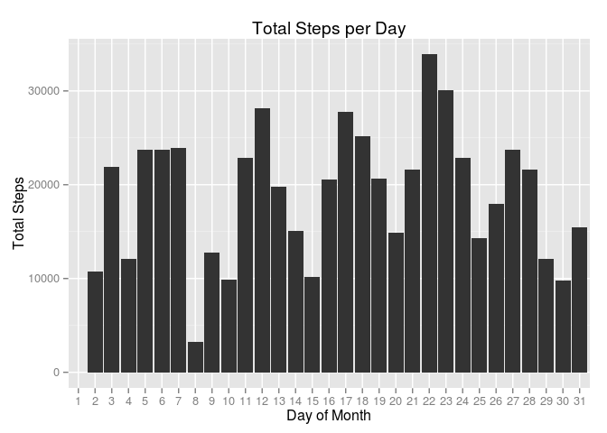
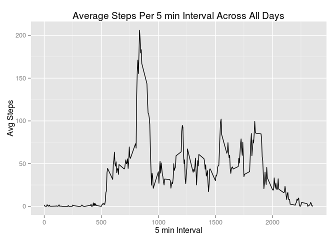
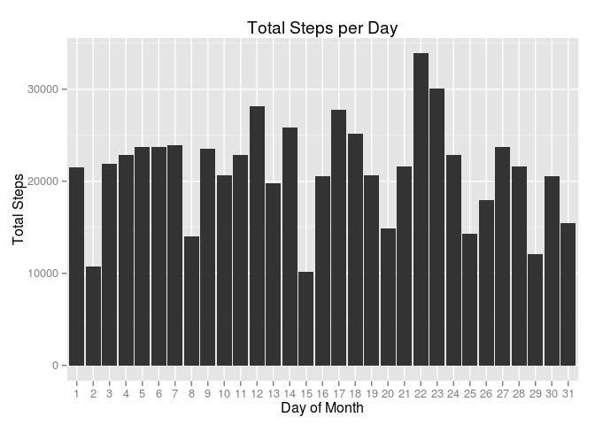
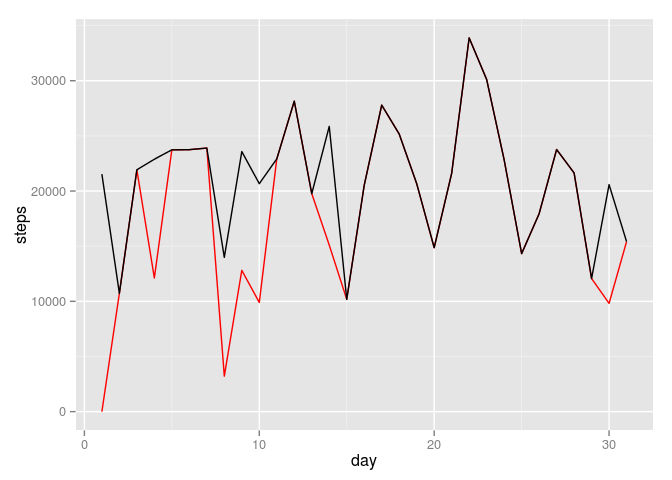
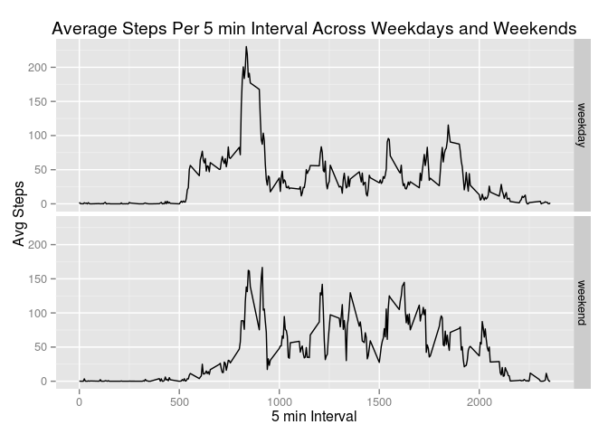

# Reproducible Research: Peer Assessment 1

## Load the required packages  

```r
        library(ggplot2)
        library(lubridate)
        library(dplyr)          
```

```
## 
## Attaching package: 'dplyr'
## 
## The following objects are masked from 'package:lubridate':
## 
##     intersect, setdiff, union
## 
## The following object is masked from 'package:stats':
## 
##     filter
## 
## The following objects are masked from 'package:base':
## 
##     intersect, setdiff, setequal, union
```

## Loading and preprocessing the data  
1. Load the data  

```r
        file = unzip('activity.zip', 'activity.csv')
        activity <- read.csv(file, stringsAsFactors = F)  
```
2. Process/transform the data (if necessary) into a format suitable for your analysis  

```r
        activity$date <- ymd(activity$date)
        activity$day <- day(activity$date)  
```
## What is mean total number of steps taken per day?  
1. Calculate the total number of steps taken per day  

```r
        StepsPerDay <- activity %>% group_by(day) %>% summarise(totalSteps = sum(steps, na.rm = T))         
```
2. Histogram of the total number of steps taken each day    

```r
        ggplot(StepsPerDay, aes(x = factor(day), y = totalSteps)) + geom_histogram(stat = 'identity') + labs(title = 'Total Steps per Day') + labs (x = 'Day of Month', y = 'Total Steps')  
```


3. Mean and Median of Total number of Steps taken each day    

```r
        SummarySteps <- activity %>% group_by(day) %>% summarise(meanSteps = mean(steps, na.rm = T), medianSteps = median(steps, na.rm = T))
        SummarySteps          
```

```
## Source: local data frame [31 x 3]
## 
##    day meanSteps medianSteps
## 1    1        NA          NA
## 2    2  18.62153           0
## 3    3  38.06076           0
## 4    4  42.06944           0
## 5    5  41.20312           0
## 6    6  41.23958           0
## 7    7  41.48958           0
## 8    8  11.17708           0
## 9    9  44.48264           0
## 10  10  34.37500           0
## .. ...       ...         ...
```
## What is the average daily activity pattern?    
1. Time series plot of the 5-minute interval (x-axis) and the average number of steps taken, averaged across all days (y-axis)  

```r
        TimeSeries <- activity %>% group_by(day) %>% group_by(interval) %>% summarise(meanSteps = mean(steps, na.rm = T))
        ggplot(TimeSeries, aes(x = interval, y = meanSteps)) + geom_line() + labs(title = 'Average Steps Per 5 min Interval Across All Days') + labs(x = '5 min Interval', y = 'Avg Steps')  
```


2. Time interval with maximum number of steps across all days  

```r
        TimeSeries[which.max(TimeSeries$meanSteps),][1]
```

```
## Source: local data frame [1 x 1]
## 
##   interval
## 1      835
```
## Imputing missing values  
1. Total number of rows with NA's or missing values  

```r
        sum(is.na(activity))  
```

```
## [1] 2304
```
2. Devise a strategy to fill in the missing values  

```r
        MeanStepsPerInterval <- activity %>% group_by(interval) %>% summarise(meanSteps = mean(steps, na.rm = T))
        ConsolidatedActivity <- merge(activity, MeanStepsPerInterval, by = 'interval')
        missing <- is.na(ConsolidatedActivity$steps)
        ConsolidatedActivity[missing, 'steps'] <- ConsolidatedActivity[missing, 'meanSteps']  
```
3. New dataset with the missing values filled  

```r
        ConsolidatedActivity <- ConsolidatedActivity %>% select(c(1,2,3,4)) %>% arrange(date)
        ConsolidatedActivity$steps <- round(ConsolidatedActivity$steps, 2)  
```
4. Histogram of total number of steps taken each day  

```r
        ConsolidatedStepsPerDay <- ConsolidatedActivity %>% group_by(day) %>% summarise(totalSteps = sum(steps, na.rm = T)) 
        ggplot(ConsolidatedStepsPerDay, aes(x = factor(day), y = totalSteps)) + geom_histogram(stat = 'identity') + labs(title = 'Total Steps per Day') + labs (x = 'Day of Month', y = 'Total Steps')  
```


**The values differ from the estimates in the first part. The plot below shows the differences between the two estimates. Red plot is for data with missing values. Black plot is for data with imputed values**  

```r
        CompareStepsPerDay <- as.data.frame(cbind(activity$day, activity$steps, ConsolidatedActivity$steps))
        colnames(CompareStepsPerDay) <- c('day', 'steps', 'stepsnomissing')
        CompareTotalStepsPerDay <- CompareStepsPerDay %>% group_by(day) %>% summarise(steps = sum(steps, na.rm = T), stepsnomissing = sum(stepsnomissing, na.rm = T)) 
        ggplot(CompareTotalStepsPerDay) + geom_line(aes(x = day, y = steps), colour = 'RED') + geom_line(aes(x = day, y = stepsnomissing))  
```


## Are there differences in activity patterns between weekdays and weekends?    
1. Create a factor variable to indicate weekday or weekend  

```r
        ConsolidatedActivity$wday <- wday(ConsolidatedActivity$date)
        ConsolidatedActivity$wday <- ifelse(ConsolidatedActivity$wday %in% 2:6, 'weekday', 'weekend')
        ConsolidatedActivity$wday <- as.factor(ConsolidatedActivity$wday)  
```
2. Panel plot containing the time series plot of the 5-minute interval and average number of steps taken across all weekdays and weekends    

```r
       ConsolidatedActivityWday <-  ConsolidatedActivity %>% group_by(wday, interval) %>% summarise(meanSteps = mean(steps, na.rm = T))
     ggplot(ConsolidatedActivityWday, aes(x = interval, y = meanSteps)) + facet_grid(wday ~ .) + geom_line() + labs(title = 'Average Steps Per 5 min Interval Across Weekdays and Weekends') + labs(x = '5 min Interval', y = 'Avg Steps')     
```


**End**  
